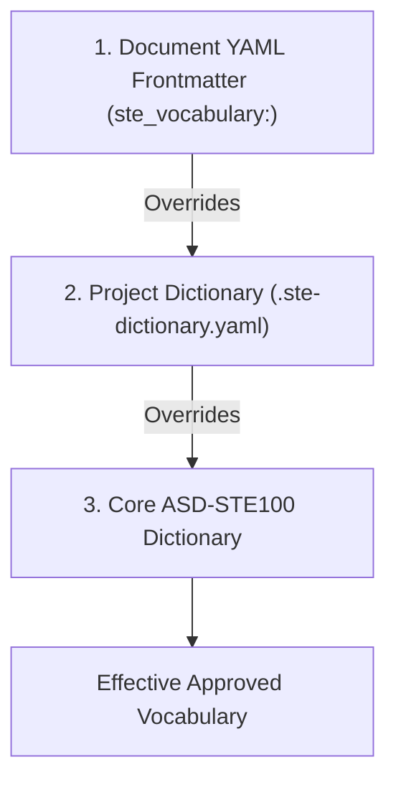

# Simplified Technical English (`ste-writing-style`)

[](https://www.asd-ste100.org/)
[](LICENSE)
[](#installation)

A collection of skills and tools for writing, auditing, and managing technical documentation according to **[ASD-STE100 Simplified Technical English (STE)](https://www.asd-ste100.org/)**. Designed for AI coding assistants (Gemini, Jetski, Antigravity).

---

## Features

- **ASD-STE100 Compliance**: Strict enforcement of controlled vocabulary, active voice, sentence length limits (≤20 words for instructions, ≤25 words for descriptions), simple tenses, and noun stacks (≤3 nouns).
- **Extensible Dictionary System**: Define domain-specific **Technical Names (TN)** and **Technical Verbs (TV)** at both the project repository level (`.ste-dictionary.yaml`) and individual document level (`ste_vocabulary:` YAML frontmatter).
- **Automated Vocabulary Discovery**: Cross-references the [`information-architecture`](https://github.com/dandye/information-architecture) skill suite (`vocabulary-overlap-analysis`, `thesaurus-generate`) to harvest domain terms from your codebase and auto-populate your STE dictionary.
- **Automated STE Auditing**: Run comprehensive compliance audits on Markdown files, PRs, and runbooks with line-by-line violation reports and suggested rewrites.

---

## Repository Structure

```text
.
├── README.md                          # Repository overview & usage guide
├── GEMINI.md                          # Agent instructions & command bindings
├── AGENTS.md                          # Agent instructions for Antigravity agents
├── gemini-extension.json              # Extension manifest
├── LICENSE                            # MIT License
└── skills/
    ├── ste-writing-style/             # Core STE writing & refactoring skill
    │   ├── SKILL.md
    │   ├── references/
    │   │   ├── ste-grammar-rules.md   # Complete ASD-STE100 rule reference
    │   │   ├── ste-general-dictionary.md # Approved core words & forbidden replacements
    │   │   └── dictionary-schema.md   # Extensible dictionary schema & frontmatter specs
    │   └── examples/
    │       ├── before-after-rewrites.md # Real-world before/after refactoring examples
    │       └── project-dictionary-example.yaml # Sample extended project dictionary
    ├── ste-audit/                     # Compliance audit skill
    │   └── SKILL.md
    └── ste-dictionary-generate/       # Automated dictionary generator skill
        └── SKILL.md
```

---

## Skills & Commands

| Command | Skill | Description |
| :--- | :--- | :--- |
| `/ste:write` / `/ste:rewrite` | **[`ste-writing-style`](skills/ste-writing-style/SKILL.md)** | Refactor technical prose into ASD-STE100 Simplified Technical English. |
| `/ste:audit` | **[`ste-audit`](skills/ste-audit/SKILL.md)** | Run a rule-by-rule STE audit on Markdown documents and produce an audit report. |
| `/ste:dict-gen` | **[`ste-dictionary-generate`](skills/ste-dictionary-generate/SKILL.md)** | Auto-extract project terms from source code/docs and generate `.ste-dictionary.yaml`. |

---

## Extensible Dictionary & Resolution Hierarchy

STE requires controlled vocabulary while allowing technical domain terms. This skill resolves approved words using a 3-tier **Priority Hierarchy**:



### 1. Document Frontmatter Overrides (`ste_vocabulary:`)
Declare file-specific Technical Names or Verbs right in your Markdown header:
```yaml
---
title: Ingress Controller Configuration
ste_vocabulary:
  technical_names:
    - "ingress controller"
    - "TLS certificate"
  technical_verbs:
    - "terminate"
  allowed_overrides:
    - word: "route"
      reason: "Approved domain action verb in Kubernetes context"
---
```

### 2. Project Repository Dictionary (`.ste-dictionary.yaml`)
Place `.ste-dictionary.yaml` in your repository root for shared domain terms across all docs:
```yaml
version: "1.0"
project: "CloudPlatform"

technical_names:
  - term: "cluster"
    category: "software"
    definition: "Set of worker nodes that run containerized applications."

technical_verbs:
  - term: "deploy"
    definition: "Install and start an application on a cluster."

forbidden_project_words:
  - word: "spin up"
    replacement: "start"
```

---

## Cross-Reference with `information-architecture`

This extension works seamlessly alongside [`dandye/information-architecture`](https://github.com/dandye/information-architecture):

1. Run `/ia:vocab-overlap` (`vocabulary-overlap-analysis`) to scan your codebase or documentation corpus for unique entities, product terms, and jargon.
2. Run `/ia:thesaurus` (`thesaurus-generate`) to map variants to canonical preferred terms.
3. Run `/ste:dict-gen` (`ste-dictionary-generate`) to convert the output into a formatted `.ste-dictionary.yaml`.

---

## Installation

### Option A: Install into Local Agent Customizations (`.agents/skills/`)
Clone or copy the `skills/` directory into your project's `.agents/skills/` folder:
```bash
mkdir -p .agents/skills
cp -r skills/* .agents/skills/
```

### Option B: Install Globally (`~/.gemini/config/skills/`)
Copy the skills to your global configuration directory:
```bash
mkdir -p ~/.gemini/config/skills
cp -r skills/* ~/.gemini/config/skills/
```

---

## License

Distributed under the MIT License. See [`LICENSE`](LICENSE) for details.
